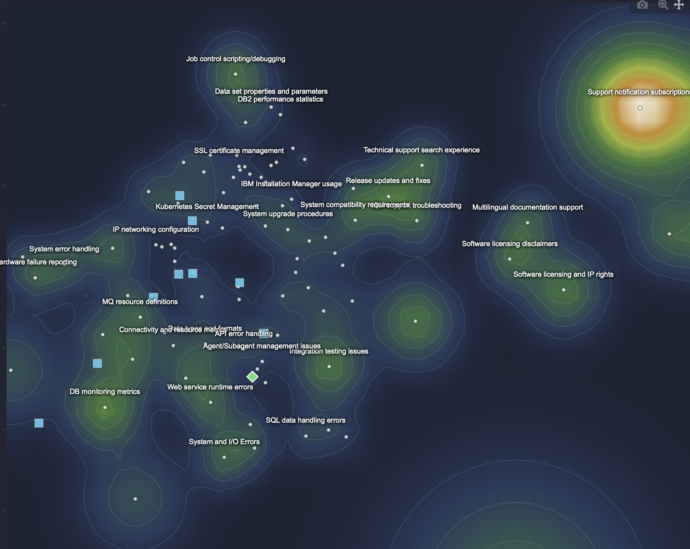

# CLAUDE.md

This file provides guidance to Claude Code (claude.ai/code) when working with code in this repository.

## What This Is

Static GitHub Pages portfolio site — plain HTML + CSS, no build step. Three projects:
1. **Visual RAG** — full project page (live)
2. **VIBE Research Assistant** — Coming Soon placeholder
3. **Watson Concept Graph** — Coming Soon placeholder

No framework, no npm. Open any `.html` directly in a browser to preview.

## Structure

```
viz-portfolio/
├── index.html                           # Landing page — 3 project cards
├── assets/
│   ├── css/style.css                    # Shared stylesheet (all pages import this)
│   └── img/                             # Screenshots (referenced by visual-rag page)
│       ├── rag-map.png                  # Embedding terrain + retrieved docs
│       ├── rag-topology.png             # Topology analysis panel
│       └── rag-answers.png              # Answer path on map
└── projects/
    ├── visual-rag/index.html            # Full editorial project page
    ├── vibe-research/index.html         # Placeholder (Coming Soon)
    └── watson-concept-graph/index.html  # Placeholder (Coming Soon)
```

## Design System

Dark minimal — all defined in `assets/css/style.css` as CSS variables:

| Variable | Value | Role |
|---|---|---|
| `--bg` | `#0f1117` | Page background |
| `--bg-card` | `#1a1f2e` | Card / section background |
| `--border` | `#1e2130` | Default border |
| `--border-hover` | `#2d3550` | Hover border |
| `--text` | `#e2e8f0` | Primary text |
| `--muted` | `#64748b` | Secondary / caption text |
| `--blue` | `#60a5fa` | Accent / labels |
| `--green` | `#4ade80` | Highlight / metric names |

Font: Inter via Google Fonts CDN. No Tailwind — pure custom CSS.

## Visual RAG Page Layout

`projects/visual-rag/index.html` uses a **two-column editorial layout** (`.editorial`):
- Left column (200px): sticky section label in `--blue`
- Right column: `h2` + prose `p` tags + optional screenshot or metric grid

Sections in order: Hero → Demo Video → Pipeline → Cluster Space → Topology Analysis → Directed Generation → Session History

### Updating the Demo Video
Find the commented-out iframe and replace `VIDEO_ID`:
```html
<!-- <iframe src="https://www.youtube.com/embed/VIDEO_ID" allowfullscreen></iframe> -->
```
Remove the `<!-- -->` wrapper and the `.video-placeholder` div below it.

### Updating Screenshots
Images live in `assets/img/`. The `` tags are already active (not commented out). To swap a screenshot, replace the file at the same path. Captions are in `.screenshot-caption` divs directly below each `.screenshot-block`.

### Adding a Landing Page Thumbnail for Visual RAG
The Visual RAG card in `index.html` currently shows a CSS text placeholder. To add a real thumbnail:
```html
<!-- In index.html, inside the Visual RAG .card-thumb div, replace the placeholder div with: -->

```

## Pending Work

- [ ] **GitHub repo + Pages setup**: Create `viz-portfolio` repo, push, enable Pages on `main` branch root
- [ ] **Demo video**: Record and upload to YouTube, then update `VIDEO_ID` in `projects/visual-rag/index.html`
- [ ] **Landing thumbnail**: Add real screenshot to Visual RAG card in `index.html`
- [ ] **VIBE Research Assistant**: Fill in `projects/vibe-research/index.html` when project is ready — follow the same editorial layout as visual-rag
- [ ] **Watson Concept Graph**: Same as above for `projects/watson-concept-graph/index.html`
- [ ] **Favicon**: Add a favicon (e.g. the ⬡ hex as SVG) — insert `<link rel="icon" ...>` in each `<head>`
- [ ] **OG meta tags**: Add `og:title`, `og:description`, `og:image` to each page for social sharing

## GitHub Pages Deployment

```bash
# From viz-portfolio directory
git init
git add .
git commit -m "init portfolio"
gh repo create viz-portfolio --public --source=. --remote=origin --push

# Then on GitHub: Settings → Pages → Source: Deploy from branch → main / (root)
# Site will be live at: https://<username>.github.io/viz-portfolio/
```

Alternatively push to a repo named `<username>.github.io` for a root domain (`https://<username>.github.io`).

## Style Conventions

- All page-specific CSS goes in a `<style>` block inside the relevant `index.html` — do not add project-specific rules to `assets/css/style.css`
- `assets/css/style.css` is for shared components only: `.badge`, `.btn`, `.container`, `.editorial`, `.site-header`, `.site-footer`, `.video-wrapper`, etc.
- Keep prose short — this is an editorial portfolio, not documentation. Aim for 1–2 paragraphs per section, `<strong>` for key terms
- Screenshots use `.screenshot-block` → `.screenshot-placeholder` (acts as frame) → `` → `.screenshot-caption`
